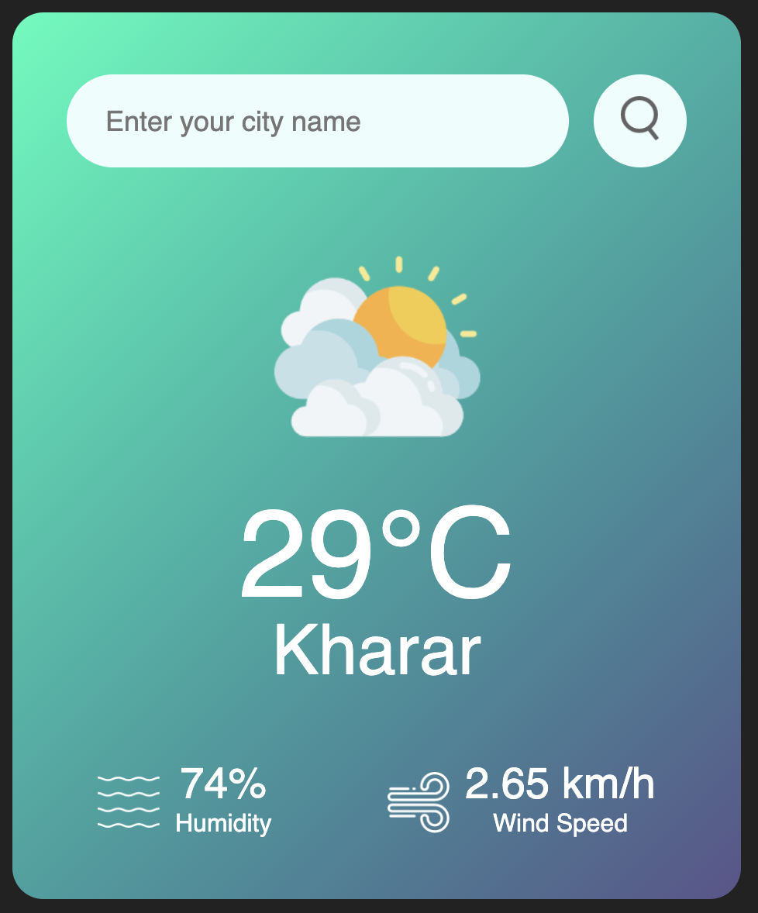

# 🌦 Weather Application

A simple and responsive **Weather Application** built using **HTML, CSS, and JavaScript** that fetches real-time weather data from the **OpenWeather API**.  
It allows users to search for a city’s weather or automatically get the weather based on their **current location (Geolocation API)**.

---

## 🚀 Features
- 🌍 Search weather by **city name**.
- 📍 Get **current location weather** automatically on page load.
- 🌡 Shows:
  - Temperature (°C)
  - City name
  - Humidity (%)
  - Wind speed (km/h)
- 🌤 Dynamic weather icons (Clear, Clouds, Rain, Drizzle, Mist).
- ⚠️ Error handling for invalid city names.
- 🎨 Responsive and modern UI with gradient card design.

---

## 🛠️ Technologies Used
- **HTML5** – Structure of the app  
- **CSS3** – Styling with gradients & responsive design  
- **JavaScript (ES6)** – Fetch API, Geolocation API, DOM Manipulation  
- **OpenWeather API** – Real-time weather data  

---

## 📸 Screenshots

### Main Interface

